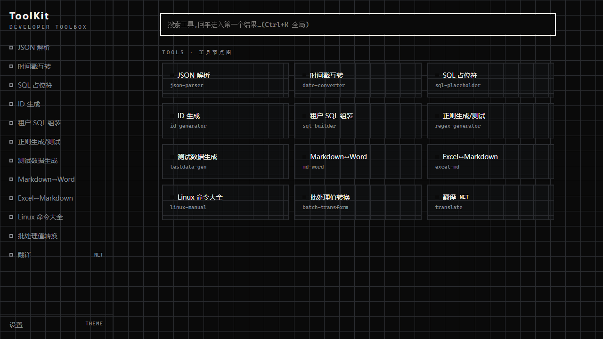

<p align="center">
  
</p>

<h1 align="center">ToolKit</h1>

<p align="center">
  <em>Local-first developer toolbox · 本地优先的中文开发者工具箱<br/>
  One codebase, two outputs: Electron desktop + static web.</em>
</p>

<p align="center">
  
  
  
  
  
  
  
  
  
</p>

> **The Circuit Workbench** — 一块带电的开发者工作台。21 个高频开发苦力活挂在同一条线路上，电流流过即点亮：粘贴即出、复制即用。

**ToolKit** gathers the grindy, repetitive work of daily development into one place — assembling bulk SQL, parsing JSON copied out of a log, converting timestamps, Markdown↔Word, looking up a Linux command. The flow is always the same: **copy from a log/console → paste → instant result → copy back to your IDE or terminal.** Every tool is pure front-end and local-first, so there is no server to expire and nothing to sign up for.

**中文版:** [README.zh-CN.md](README.zh-CN.md)



## ✨ Highlights

- **Paste-and-go** — no "convert" button between input and result; auto-detect + instant transform (debounced ≤ 200 ms).
- **Offline-complete** — all tools compute locally; the desktop app stays fully usable even after the online server is gone.
- **One codebase, two outputs** — `src/renderer` is environment-agnostic; the same code ships as an Electron desktop app (the product) and a static web build (the transitional online edition).
- **Registry-driven, 21 tools** — adding a tool = one directory + one line in `register.ts` + one line in `transform.worker.ts`.
- **No silent failure** — every error is seen and localised with a tri-state result (OK / ERROR / EMPTY).
- **Multi-theme** — daisyUI theme system: 深色工作台 (dark workbench) / 纸白 (paper) / 焦糖 (caramel), plus custom.

## 📦 Download

Pre-built desktop installers are published as [Releases](https://github.com/xiaoweizano/Tool-Kit/releases).

| Platform | File | Size |
|---|---|---|
| Windows | `ToolKit-0.1.0-setup.exe` | ~60 MB |
| macOS (Apple Silicon) | `ToolKit-0.1.0-arm64.dmg` | ~65 MB |
| macOS (Intel) | `ToolKit-0.1.0-x64.dmg` | ~65 MB |

> **First run warning:** builds are unsigned. On Windows accept the SmartScreen prompt; on macOS right-click → **Open** once. See [First run](#first-run-unsigned-builds) for details.

## 🧰 Tools (21)

### Data & Format
| Tool | Icon | What it does |
|---|---|---|
| [JSON 解析](src/renderer/src/tools/json-parser) | 🗂 | Parse & pretty-print JSON, tolerant of log-escaped and double-encoded input |
| [时间戳互转](src/renderer/src/tools/date-converter) | 🕒 | Unix timestamp ↔ date, auto-detects seconds / ms / µs / ns |
| [进制转换](src/renderer/src/tools/base-converter) | 🔢 | Base conversion (bin / oct / dec / hex) with prefix auto-detect |
| [文本处理](src/renderer/src/tools/text-diff) | 📝 | Text diff and comparison |

### Query & SQL
| Tool | Icon | What it does |
|---|---|---|
| [SQL 占位符](src/renderer/src/tools/sql-placeholder) | 🧩 | Convert SQL between `?` placeholders and `:named` params |
| [租户 SQL 组装](src/renderer/src/tools/sql-builder) | 🏗 | Assemble multi-tenant SQL |
| [测试数据生成](src/renderer/src/tools/testdata-gen) | 🎲 | Generate random test data |
| [ES 查询构造](src/renderer/src/tools/es-query-builder) | 🔍 | Build an Elasticsearch query DSL, paste-and-parse back |
| [正则生成/测试](src/renderer/src/tools/regex-generator) | 🧠 | Generate and test regular expressions |

### Documents & Export
| Tool | Icon | What it does |
|---|---|---|
| [Markdown↔Word](src/renderer/src/tools/md-word) | 📄 | Markdown ↔ Word conversion |
| [Excel↔Markdown](src/renderer/src/tools/excel-md) | 📊 | Excel ↔ Markdown conversion |

### Security & Crypto
| Tool | Icon | What it does |
|---|---|---|
| [密码工具](src/renderer/src/tools/password-tools) | 🔐 | Password generator, strength analysis, AES/RSA, bcrypt |
| [JWT 解析](src/renderer/src/tools/jwt-tool) | 🪪 | Parse, verify, sign and renew JWTs (HS / RS / ES / PS) |
| [ID 生成](src/renderer/src/tools/id-generator) | 🆔 | UUID / snowflake / nanoid-style ID generators |

### Config & Infra
| Tool | Icon | What it does |
|---|---|---|
| [Docker 生成](src/renderer/src/tools/docker-tools) | 🐳 | Generate `docker run`, `docker-compose`, and `Dockerfile` |
| [nginx 配置](src/renderer/src/tools/nginx-generator) | ⚙️ | Multi-server nginx config with SSL, proxy, upstream, location |
| [JVM 参数](src/renderer/src/tools/jvm-params) | ☕ | Generate tuned JVM flags (presets + checkbox options) |
| [Linux 命令大全](src/renderer/src/tools/linux-manual) | 🐧 | Searchable common Linux commands |

### Dev Utilities
| Tool | Icon | What it does |
|---|---|---|
| [批处理值转换](src/renderer/src/tools/batch-transform) | 🔁 | Batch value transform / re-encode |
| [翻译](src/renderer/src/tools/translate) | 🌐 | Translation (online enhancement, off by default) |
| [日志分析](src/renderer/src/tools/log-analyzer) | 📈 | Log error-rate analysis and timeline |

## 🚀 Quick start

```bash
pnpm install
pnpm dev:web      # browser only (fastest)
pnpm dev          # Electron desktop shell + HMR
```

Test, typecheck and build:

```bash
pnpm test         # Vitest (golden-file transform tests)
pnpm typecheck    # tsc --noEmit
pnpm build:web    # static output → dist/web
pnpm build:desktop  # Win nsis / Mac dmg (unsigned; see "First run")
```

### Build the desktop app locally

```bash
# Full build with signing (requires codesigning identities configured)
pnpm build:desktop

# Artifacts land in dist_electron/
#   Windows → dist_electron/ToolKit Setup 0.1.0.exe
#   macOS   → dist_electron/ToolKit-0.1.0-arm64.dmg (or -x64.dmg)
```

The desktop build uses `electron-builder` with NSIS (Windows) and DMG (macOS). Configuration is in [`electron-builder.yml`](electron-builder.yml). To sign on macOS, set `electronBuildConfig.mac.identity` in that file and run with `APPLE_ID` / `APPLE_APP_SPECIFIC_PASSWORD` env vars.

## 🏗 Architecture — one codebase, two outputs

```
┌──────────── src/renderer (environment-agnostic, no Electron imports) ────────────┐
│ app shell · home overview · settings · tool pages (registry-driven) · core       │
│   (types/store/Web Worker transforms)                                            │
└──────────────────────────┬──────────────────────────────┬────────────────────────┘
                  vite static build              electron-vite + Electron shell
             ┌───────────▼──────────▐        ┌───────────▼──────────▐
             │  GitHub Pages / static  │        │  Win nsis · Mac dmg    │
             │  online (transitional)  │        │  desktop (the product) │
             └────────────────────────┘        └────────────────────────┘
```

A tool is a pure function: an input string in, a `ToolResult` out. Runs in a Web Worker so heavy transforms never block the UI; golden-file tests lock conversion fidelity. Add one = `src/tools/<id>/` + `register.ts` line + `transform.worker.ts` line.

## ☁️ Deploy the static web build

The online edition is a pure static bundle (`dist/web`) — HashRouter + relative paths, so any static server needs zero fallback config.

```bash
pnpm build:web
cd deploy && docker compose up -d   # serves ../dist/web on :8080
```

```bash
# local build (or upload dist/web built by CI)
pnpm build:web

# after uploading dist/web and deploy/ to the server:
cd deploy && docker compose up -d
# visit http://<server-ip>:8080
```

`deploy/docker-compose.yml` mounts `../dist/web` read-only behind `nginx:alpine` (gzip, long-cache assets, no-cache entry). Updating = rebuild → overwrite `dist/web` → `docker compose restart`. Coexists with GitHub Pages (a free, long-lived static mirror) — the private server is the self-controlled transitional tier.

## First run (unsigned builds)

- **Windows**: if SmartScreen blocks the installer → **More info → Run anyway**.
- **macOS**: after installing the dmg, if Gatekeeper blocks → in **Finder** right-click **ToolKit → Open → Open** (Apple Silicon uses an ad-hoc signature, already baked into the build).

## 📄 License

[MIT](LICENSE) © 2026 xiaoweizano
